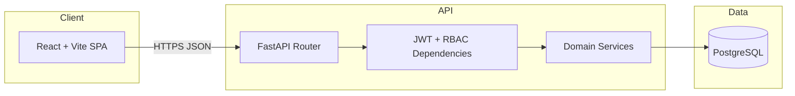
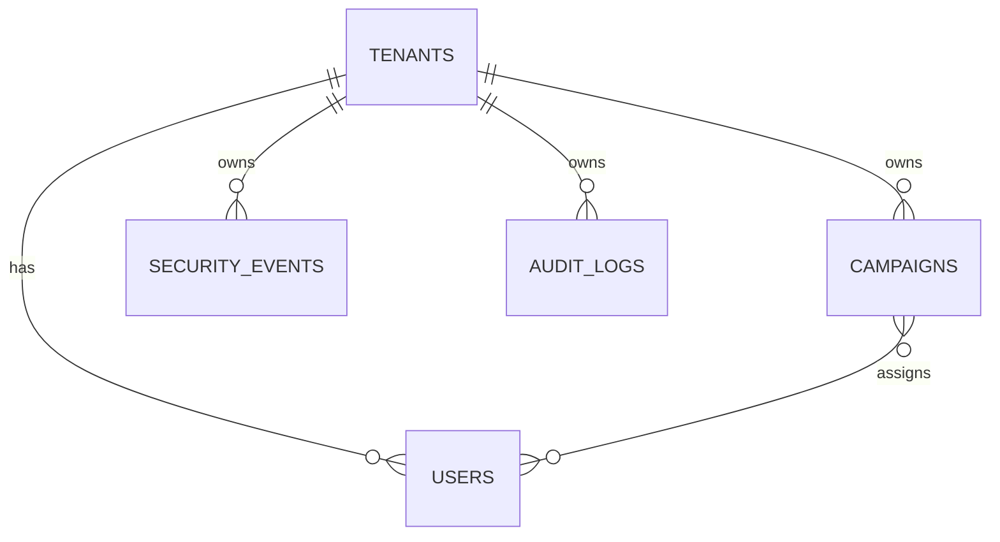

# System Design — Multi-Tenant Security Management Platform

## 1. Problem statement

Build a secure multi-tenant platform where multiple organizations share one deployment while **data remains isolated**. Users manage security campaigns, monitor security events, and review audit activity under role-based permissions.

## 2. High-level architecture



## 3. Layered backend design

| Layer | Responsibility |
|---|---|
| `api/v1/endpoints` | HTTP mapping, request validation, status codes |
| `core` | Settings, JWT, password hashing, RBAC helpers, auth dependencies |
| `schemas` | Input/output contracts (Pydantic) |
| `models` | Persistence entities + relationships |
| `services` | Business rules (campaign status transitions, audit writer) |
| `db` | Engine/session lifecycle |

This mirrors the flow used in your previous full-stack projects:

`Frontend UI → FastAPI → Auth → RBAC → Database → Business Logic`

## 4. Data model



Key constraints:
- `users (tenant_id, email)` unique
- All child tables include `tenant_id` FK
- Campaign assignment via `campaign_assignments` join table

## 5. Authentication & authorization

### Authentication
- `POST /api/auth/login` with OAuth2 password form (`username=email`)
- JWT payload includes `sub` (user id), `tenant_id`, `role`, `exp`
- Passwords hashed with bcrypt

### Authorization (RBAC)
| Capability | ADMIN | MANAGER | USER |
|---|---:|---:|---:|
| Dashboard metrics | ✅ | ✅ | ✅ |
| Campaign list (tenant) | ✅ all | ✅ all | ✅ assigned only |
| Campaign create/update/delete | ✅ | ✅ | ❌ |
| Assign users to campaigns | ✅ | ✅ | ❌ |
| Security events read | ✅ | ✅ | ✅ |
| Security events write | ✅ | ✅ | ❌ |
| User management | ✅ | ❌ | ❌ |
| Audit logs | ✅ | ✅ | ❌ |

Backend enforces permissions in route dependencies and service checks; frontend only hides UI actions.

## 6. Tenant isolation strategy

**Rule:** every data query includes `tenant_id == current_user.tenant_id`.

- Never accept `tenantId` from request body/query for authorization decisions.
- Cross-tenant ID probing returns **404** (not 403) to avoid existence leaks.
- Seed includes Campaign `201` in Tenant B for mandatory scenario validation.

## 7. Campaign lifecycle

Allowed transitions:
- `DRAFT → ACTIVE | CANCELLED`
- `ACTIVE → COMPLETED | CANCELLED`
- `COMPLETED` / `CANCELLED` are terminal

Invalid transitions return `400 Bad Request`.

## 8. Audit logging

Recorded actions include:
- Login
- User create/update
- Campaign create/update/delete
- Campaign user assign/remove
- Security event create/update/delete

Audit entries are tenant-scoped and visible to ADMIN/MANAGER.

## 9. Frontend module map

```
src/
  api/client.js          # Axios instance + JWT header
  context/AuthContext.jsx
  layouts/AppLayout.jsx
  pages/
    LoginPage.jsx
    DashboardPage.jsx
    CampaignsPage.jsx
    SecurityEventsPage.jsx
    UsersPage.jsx
    AuditLogsPage.jsx
```

UI features required by assessment:
- Login
- Tenant dashboard metrics + recent activity
- Campaign CRUD UI (role-aware)
- Security events filters + pagination
- User list with roles
- Role-aware navigation/actions

## 10. Operational view

- `docker-compose.yml` runs PostgreSQL locally
- `.env.example` documents secrets and CORS
- `scripts/seed.py` bootstraps demo tenants and test data on first startup

## 11. Non-functional considerations

- **Performance:** server-side pagination/filtering for list endpoints
- **Security:** ORM-only DB access, JWT auth, RBAC checks, tenant scoping
- **Maintainability:** clear module boundaries and typed schemas
- **Extensibility:** add refresh tokens, OpenAPI export, CI, and integration tests as bonus items
